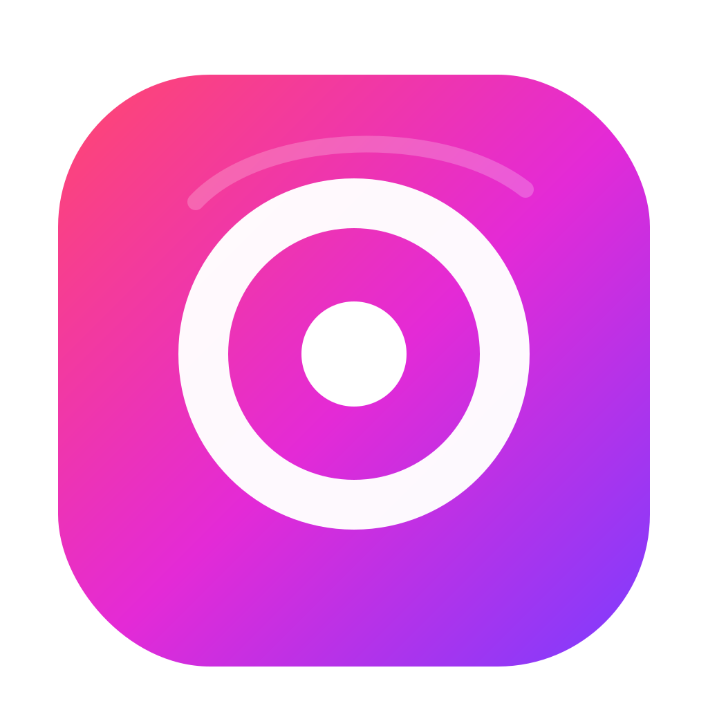
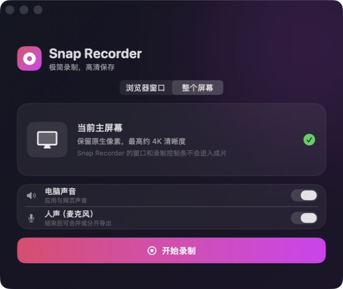

# Snap Recorder

<div align="center">
  
  <p><strong>只录屏，不做工作室。</strong></p>
  <p>极简 · 高清 · 双模式 · 本地处理 · Universal 2</p>
  <p>
    <a href="https://github.com/shuyan-5200/snap-recorder/releases/latest"><strong>下载最新版</strong></a>
    ·
    <a href="#从源码构建">从源码构建</a>
  </p>
</div>

Screen Studio 这类产品很强，但很多时候，我只需要：选定浏览器或屏幕，按下录制，得到一份足够清晰的视频。

Snap Recorder 为这条最短路径而生。没有编辑器、自动变焦、账号和云端，只留下录制本身。

<p align="center">
  
</p>

## 特性

- **两种录制模式**：独立捕获一个浏览器窗口，或录制当前主屏幕。
- **两路声音开关**：电脑声音与人声分别控制；麦克风默认关闭。
- **实用导出**：完整 MP4、视频 MP4 + 人声 M4A 可以单选，也可以一次同时保存。
- **高清成片**：原生像素优先，最高 3840×2160；H.264 High Profile，合并人声时视频轨不二次编码。
- **小而本地**：v0.2.0 Universal App 约 2.2 MB，ZIP 约 1.4 MB；无账号、无统计、无网络请求。

选择来源后，Snap Recorder 会倒计时 3 秒并隐藏主界面。录制中支持暂停、继续和结束，完成后直接保存到“下载”。Snap Recorder 自己的窗口和控制条不会进入成片。

## 两种录制模式

| 模式 | 画面 |
| --- | --- |
| 浏览器窗口 | 只捕获选中的 Safari、Chrome、Edge、Arc、Firefox、Brave、Orion 或 Opera 窗口；其他应用、通知、Dock 和桌面图标不会出现。浏览器接近铺满成片，并保留一圈轻微壁纸背景、圆角和阴影。 |
| 当前主屏幕 | 保持主显示器原始比例与原生像素，最高 3840×2160；适合演示多个应用或完整桌面流程。 |

浏览器窗口不需要最大化，只要没有真正最小化就能录制。

## 声音与导出

| 录制或导出选择 | 得到的文件 |
| --- | --- |
| 未开启人声 | 自动保存 1 个 MP4，没有额外步骤。 |
| 完整视频 | 画面 + 电脑声音（如有）+ 人声，合成 1 个 MP4。 |
| 视频和人声分轨 | 视频 MP4（保留电脑声音，如有）+ 对齐时长的人声 M4A；可以直接交给剪辑软件继续处理。 |
| 两项都选 | 一次得到完整 MP4、分轨 MP4 和人声 M4A，共 3 个文件，不打 ZIP。 |

人声文件使用 AAC-LC、48 kHz、192 kbps；完整视频的混合音频为 48 kHz、256 kbps。

## 安装

1. 从 [Releases](https://github.com/shuyan-5200/snap-recorder/releases/latest) 下载 ZIP 并解压。
2. 把 `Snap Recorder.app` 移入“应用程序”。
3. 首次启动时允许“屏幕与系统音频录制”；开启人声时再允许麦克风。

当前预编译 App 尚未经过 Apple 公证。首次启动如果被 macOS 拦截，请右键 `Snap Recorder.app` →“打开”；仍被拦截时，前往“系统设置”→“隐私与安全性”→“仍要打开”。

## 系统要求

- 基础录屏：macOS 14 或更高版本。
- 人声录制：macOS 15 或更高版本。
- 支持 Apple Silicon 与 Intel Mac；预编译 App 为 Universal 2。

## 从源码构建

Snap Recorder 使用 SwiftUI、AppKit、ScreenCaptureKit、Core Image 和 AVFoundation，不依赖第三方库。

```bash
git clone https://github.com/shuyan-5200/snap-recorder.git
cd snap-recorder
./scripts/build-app.sh
```

构建结果位于 `build/Snap Recorder.app`。运行自动自检：

```bash
.build/release/SnapRecorder --self-test
```

## 隐私与边界

所有录屏和声音都只在本机处理。Snap Recorder 不联网、不上传、不收集统计，也不包含第三方分析 SDK。详见 [隐私说明](PRIVACY.md)。

为了保持极简，当前不提供编辑器、剪辑、自动变焦、摄像头、区域录制、多显示器选择或云分享。DRM 受保护内容仍可能被 macOS 显示为黑屏。

实现细节与验证记录见 [技术说明](docs/technical-notes.md) 和 [验证清单](docs/verification.md)。欢迎阅读 [贡献指南](CONTRIBUTING.md) 后提交 Issue 或 Pull Request。

## License

[MIT License](LICENSE)
