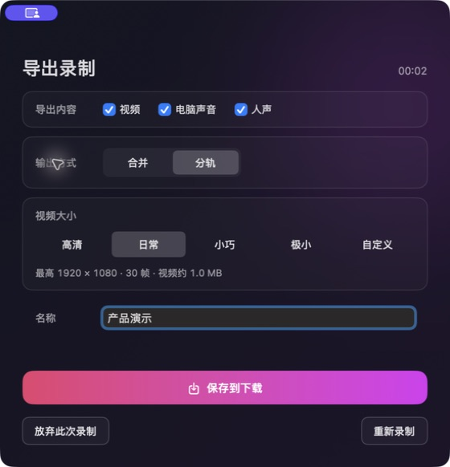
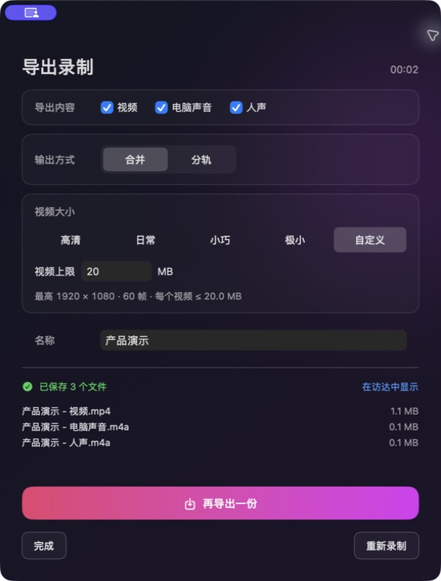

<div align="center">
  
  <h1>Snap Recorder</h1>
  <p><strong>极简录屏，自在导出。</strong></p>
  <p>录下浏览器、整个屏幕或任意区域。视频、电脑声音、人声，按需合并或分轨。</p>
  <p>
    <a href="https://shuyan-5200.github.io/snap-recorder/"><strong>产品介绍</strong></a>
    &nbsp; · &nbsp;
    <a href="https://github.com/shuyan-5200/snap-recorder/releases/download/v1.0.0/Snap-Recorder-v1.0.0-macOS-universal.zip"><strong>下载 1.0.0</strong></a>
    &nbsp; · &nbsp;
    <a href="https://github.com/shuyan-5200/snap-recorder/releases/latest">版本与更新</a>
  </p>
  <p><sub>macOS 14+ · Apple Silicon / Intel · ZIP 约 2.2 MB · MIT 开源</sub></p>
  <p><sub>A lightweight, local-first macOS screen recorder with flexible video and audio exports.</sub></p>
</div>

## 关键亮点

- **三种录制来源**：浏览器窗口、整个屏幕、局部录像，保持原始画面比例。
- **声音自由组合**：勾选视频、电脑声音、人声，再选择合并或分轨；也能只导出声音。
- **五档视频大小**：高清、日常、小巧、极小、自定义。随手记录用极小，限制体积时直接填写 MB。
- **一次录制，多次导出**：保存前命名，保存后可换模式、大小或名称继续导出；录得不满意可以直接放弃或重录。
- **可选人像与鼠标效果**：摄像头画中画、自然修饰、鼠标光点和点击波纹，按需开启。
- **全程本地处理**：无账号、无上传、无统计，文件保存到 Mac 的“下载”目录。

<p align="center">
  
  <br>
  <sub>0.5.0（build 13）实际界面，使用生成的演示素材截图。</sub>
</p>

## 从录制到保存

**选择来源 → 3 秒倒计时 → 录制 → 选择导出内容、大小并命名 → 确认保存**

| 来源 | 适合的场景 |
| --- | --- |
| 浏览器窗口 | 只录一个浏览器窗口，完整保留窗口比例，其他应用与桌面不进入成片。 |
| 整个屏幕 | 录制当前主显示器，适合跨应用演示。 |
| 局部录像 | 自由调整范围，提供 16:9、9:16、4:3、3:4、21:9、1:1 和自定义比例，可选圆角与聚焦蒙版。 |

电脑声音、人声和摄像头独立开关，人声与摄像头默认关闭。录制中可暂停、继续或结束。

主面板可以正常截图，开始录制时会自动收起；若要演示 Snap Recorder 本身，可从菜单栏打开主面板并拖入整屏或局部录制范围。倒计时、录制控制条、选区框与摄像头预览等辅助浮窗不会进入成片。

## 导出你需要的内容

勾选**视频 / 电脑声音 / 人声**，每次选择一种输出方式。未录制的声音不可勾选。

| 选择 | 输出文件 |
| --- | --- |
| 三项全选 + 合并 | 一个带电脑声音与人声的 MP4。 |
| 三项全选 + 分轨 | 无声 MP4、电脑声音 M4A、人声 M4A，各一份。 |
| 只选电脑声音与人声 + 合并 | 一个混合声音的 M4A。 |
| 只选其中一项 | 单独的视频或音频文件。 |

例如，想保留“画面 + 电脑声音”，同时单独处理人声：先勾选视频和电脑声音，选择合并并保存；再只勾选人声，导出一份 M4A。

名称默认使用日期和时间，可以直接修改。同名文件自动编号，不覆盖已有文件。分轨输出不会打包为 ZIP；独立人声保持原有音质，不随极小视频一起降质。麦克风实际收到的扬声器外放仍可能出现在人声中。

保存后留在同一工作区，可更换设置并点击“再导出一份”；尚未保存时可“放弃此次录制”或“重新录制”，无需先导出。已保存的文件会保留。

<p align="center">
  
  <br>
  <sub>已保存三个分轨文件后，继续选择合并与自定义大小。</sub>
</p>

## 视频大小按用途选择

| 档位 | 画面与帧率上限 | 适合用途 |
| --- | --- | --- |
| 高清 | 原始录制尺寸，30 帧 | 优先保留画面细节。 |
| 日常（默认） | 1080p，30 帧 | 日常演示与分享。 |
| 小巧 | 720p，30 帧 | 进一步节省空间。 |
| 极小 | 480p，30 帧 | 随手记录，小字细节会减少。 |
| 自定义 | 30 帧；根据时长和 MB 上限适配尺寸 | 文件有明确大小限制。 |

保留画面比例，不放大低分辨率素材。界面会显示预计大小；复杂画面在小体积档可能进一步降低尺寸。自定义 MB 是**每个 MP4 的上限**，不得低于当前录制内容“极小”档的体积预算；界面按时长、尺寸和所选音轨建议从该下限到原片大小附近的范围。独立音频文件另计。

高清会尝试保守压缩；如果文件反而增大，或抽样画面损失过多，且原片不超过 30 fps，则保留原片。旧版 60 fps 原片会转为 30 fps，不直接保留。不承诺所有录屏都能在清晰度不变的情况下大幅缩小。编码依据与历史实测见[导出流程与体积优化](docs/export-redesign.md)。

## 人像与演示效果

开启摄像头后可预览人像，支持圆角方形 / 圆形、三档大小、四角位置与镜像。自然修饰提供原图、自然、柔和三档，仅在本机处理摄像头画面，不瘦脸、不美妆、不识别身份。人像直接合入视频，不另导出摄像头文件；停止录制或关闭摄像头后释放设备。

鼠标可显示为带光晕的圆形光点，点击时出现扩散波纹；关闭“录制鼠标”后隐藏鼠标。局部录像的聚焦蒙版保留框内原色，将框外转为单色并压暗。

| 快捷键 | 作用 |
| --- | --- |
| `⌘R` | 开始录制；窗口与整屏模式需主面板在前台，局部模式锁定后可全局使用。 |
| `⌘E` | 局部模式中切换选区调整与点击穿透。 |
| `Esc` | 录制中或暂停时，全局结束录制。 |

## 安装

1. [下载 1.0.0 安装包](https://github.com/shuyan-5200/snap-recorder/releases/download/v1.0.0/Snap-Recorder-v1.0.0-macOS-universal.zip)，解压后把 `Snap Recorder.app` 拖入“应用程序”。
2. 首次启动允许“屏幕与系统音频录制”；需要人声或人像时，再分别允许麦克风与摄像头。
3. 选择来源，开始录制。

支持 **macOS 14+**、Apple Silicon 与 Intel Mac；**人声录制需要 macOS 15+**。当前版本为 **1.0.0 / build 15**，Universal ZIP 约 **2.2 MB**。[查看发布记录与历史版本](https://github.com/shuyan-5200/snap-recorder/releases)。

应用尚未经过 Apple 公证。首次启动若被 macOS 拦截，请右键应用选择“打开”；仍被拦截时，前往“系统设置”→“隐私与安全性”→“仍要打开”。

<details>
<summary>屏幕录制权限反复出现</summary>

如果以前运行过旧签名或其他位置的副本，请完全退出应用，只从“应用程序”中的同一份 Snap Recorder 启动。在系统设置的“屏幕与系统音频录制”中移除旧条目，再重新授权并按提示重启。条目仍异常时可在终端执行：

```bash
tccutil reset ScreenCapture io.github.shuyan-5200.SnapRecorder
```

</details>

## 从源码构建

使用 SwiftUI、AppKit、ScreenCaptureKit、Core Image、Vision 与 AVFoundation，无第三方库。可使用 SwiftPM 构建，无需完整 Xcode。

```bash
git clone https://github.com/shuyan-5200/snap-recorder.git
cd snap-recorder
./scripts/build-app.sh
```

构建结果为 `build/Snap Recorder.app`。运行自动自检：

```bash
swift build -c release
.build/release/SnapRecorder --self-test
```

## 隐私与边界

所有屏幕、摄像头画面和声音只在本机处理，不联网、不上传、不收集统计。详见[隐私说明](PRIVACY.md)。

当前不提供编辑器、剪辑、自动变焦、摄像头分轨、多显示器选择或云分享；DRM 受保护内容可能显示为黑屏。

更多信息：[产品规格](docs/product-spec.md) · [技术说明](docs/technical-notes.md) · [验证记录](docs/verification.md) · [贡献指南](CONTRIBUTING.md)。

## License

[MIT License](LICENSE)。感谢 [kennanzhou](https://github.com/kennanzhou/snap-recorder-Partial-recording) 贡献局部录像、聚焦蒙版与鼠标效果等改进。
